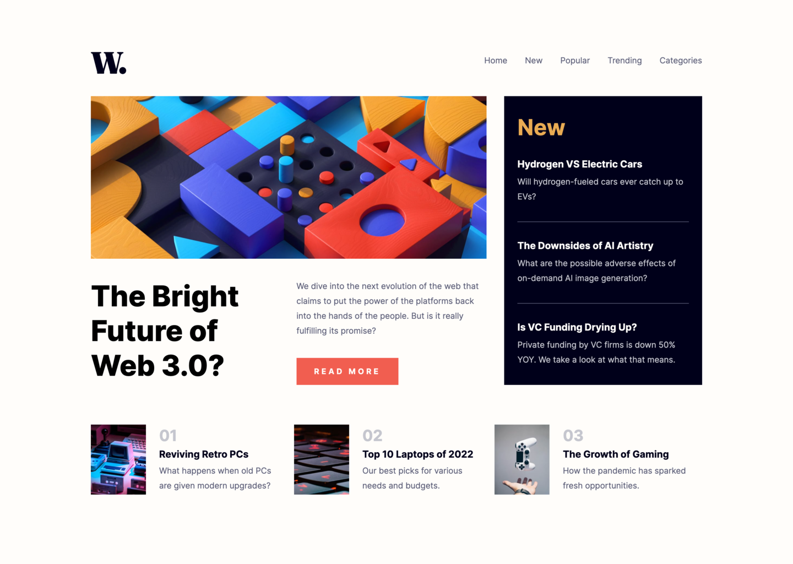
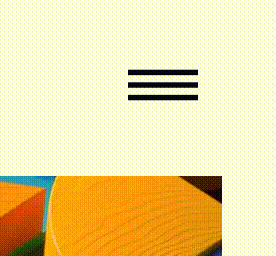

# Frontend Mentor - News homepage solution

This is a solution to the [News homepage challenge on Frontend Mentor](https://www.frontendmentor.io/challenges/news-homepage-H6SWTa1MFl). Frontend Mentor challenges help you improve your coding skills by building realistic projects.

## Table of contents

- [Overview](#overview)
  - [The challenge](#the-challenge)
  - [Screenshot](#screenshot)
  - [Links](#links)
- [My process](#my-process)
  - [Built with](#built-with)
  - [What I learned](#what-i-learned)

## Overview

### The challenge

Users should be able to:

- View the optimal layout for the interface depending on their device's screen size
- See hover and focus states for all interactive elements on the page

### Screenshot

### Links

- Solution URL: [GitHub](https://github.com/shellonix/news-homepage)
- Live Site URL: [News homepage](https://news-homepage-azure-rho.vercel.app/)

## My process

### Built with

- HTML5
- SCSS

### What I learned

Made a hover animation for the Read More button using pseudo-elements and `skewX()`.

Also made an animation for the menu icon using SVG and `rotate()`.

